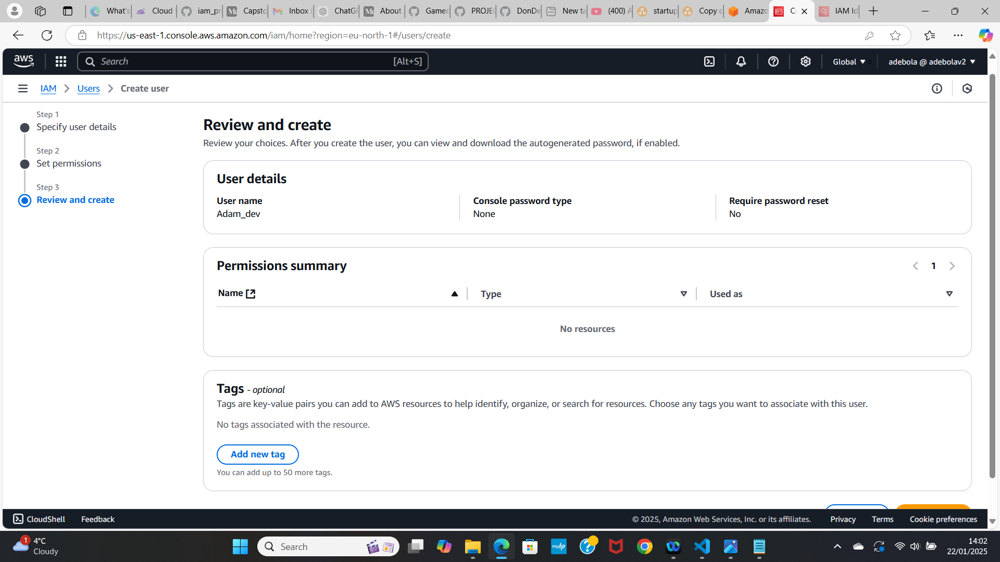
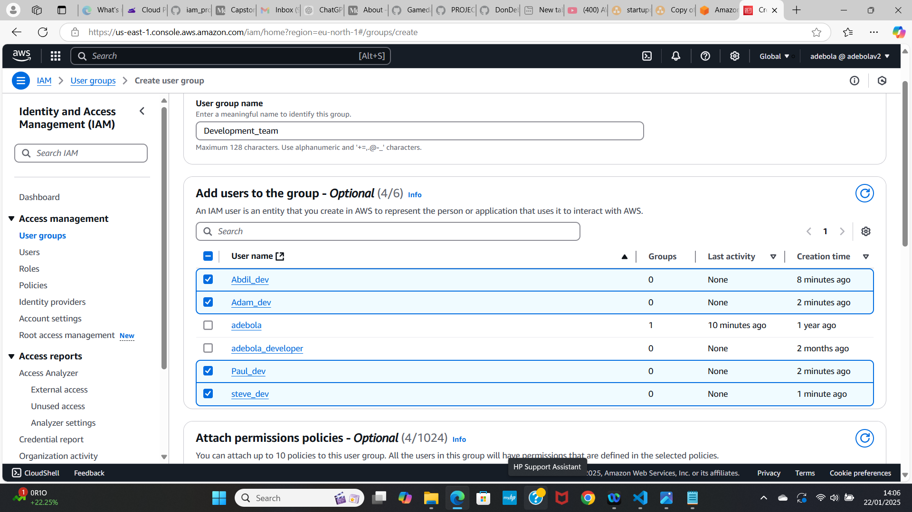

# iam_project

StartupCo, a fast-growing tech startup that recently launched their first product — a fitness tracking application. They’ve been using AWS for three months, initially setting up their infrastructure quickly to meet launch deadlines. Now that their product is live, they need to address their cloud security fundamentals. The company has 10 employees who all currently share the AWS root account credentials to access and manage their cloud resources. This practice started when they were moving quickly to launch, but now their CTO recognizes the security risks this poses.

Based on the project Brief, the first thing I have done is to secure the Root User(which is also the management account) it is best practise that this account is never used for daily activities or accessed by multiple individuals so from this account I have created an Admin user account and given the admin account the permissions it needs, like view billing access, administrator access, after doing that I logged out of my root user and into my admin user account(which is still in the management account) but following best practise I have used this Admin account to create another account which would not be in my management account and it is with this account that I have created all the users and groups needed from within the companies guidelines, we would also need to make sure we have secure passwords implemented and MFA implemented to get an extra layer of security, This needs to be applied to all user accounts.

Adding a string password policy using the console, this can also be done using terraform or cdk

