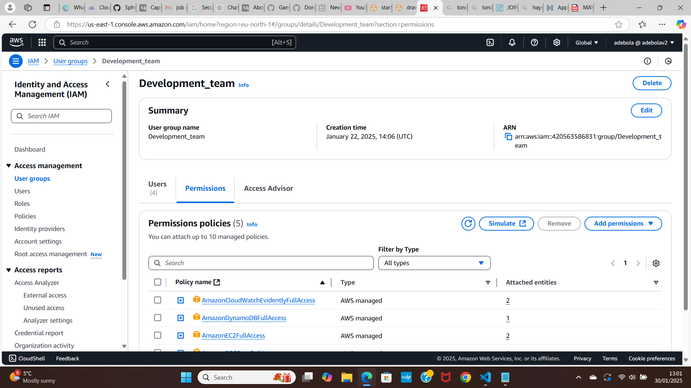
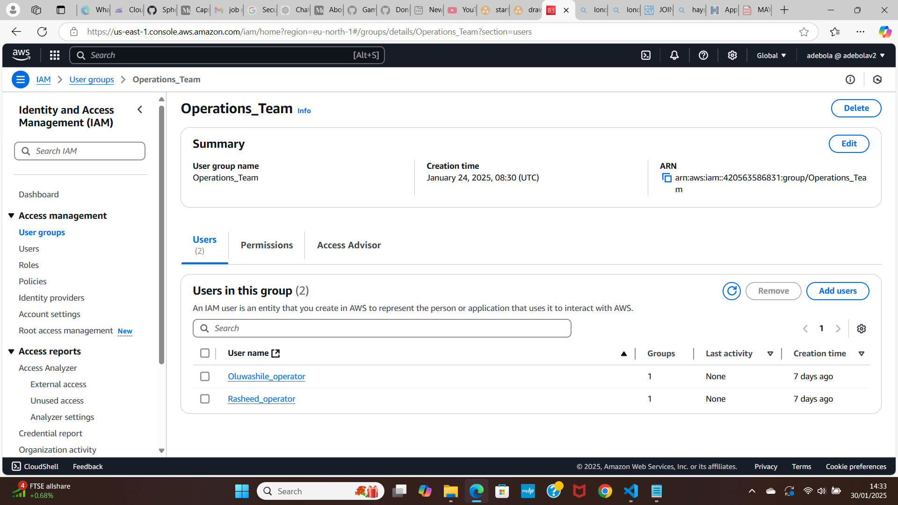
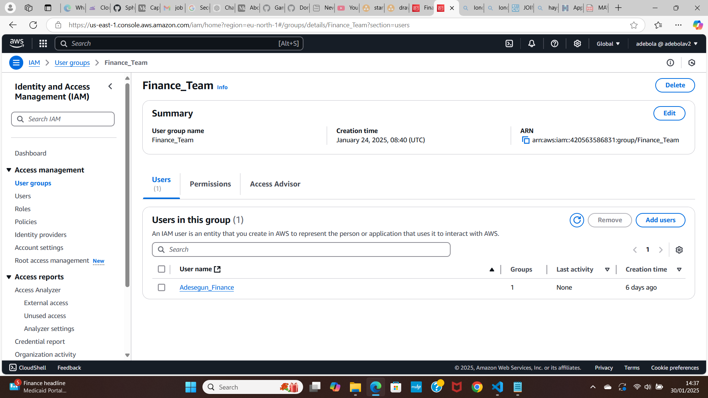

# iam_project

StartupCo, a fast-growing tech startup that recently launched their first product — a fitness tracking application. They’ve been using AWS for three months, initially setting up their infrastructure quickly to meet launch deadlines. Now that their product is live, they need to address their cloud security fundamentals. The company has 10 employees who all currently share the AWS root account credentials to access and manage their cloud resources. This practice started when they were moving quickly to launch, but now their CTO recognizes the security risks this poses.

Based on the project Brief, the first thing I have done is to secure the Root User(which is also the management account) it is best practise that this account is never used for daily activities or accessed by multiple individuals so from this account I have created an Admin user account and given the admin account the permissions it needs, like view billing access, administrator access, after doing that I logged out of my root user and into my admin user account(which is still in the management account) but following best practise I have used this Admin account to create another account which would not be in my management account and it is with this account that I have created all the users and groups needed from within the companies guidelines, we would also need to make sure we have secure passwords implemented and MFA implemented to get an extra layer of security, This needs to be applied to all user accounts.

Adding a string password policy using the console, this can also be done using terraform or cdk

So why do we need user groups?

By creating user group we can can, add or modify permission to many users at the same time to make it a quicker and more efficient process. This can all be done within the AWS console, and aslo with Iac and Terraform,  The console is great, but jumping from screen to screen humans can soon forget what they have clicked on and maybe even misclick allowing the incorrect permissions opening up more security risks . With just a few line of code we can create a quick, efficient and reliable structure that can be reused time and time again. But i would be creating with both the Console and Terraform.

The first group is for the developers:

EC2 Full access, DynamoDB full access, RDS full access, Cloudwatch full access

In this group, I’ve been giving the information and decided to give full access to EC2, and  full access RDS and DynamoDB, and CloudWatch logs as we always want to give Principle of Least Privilege. If ever unsure, always talk to the client/company to what access is require. It’s always best to give lower access then upgrade later.

Operations:

Cloudwatch full access, EC2 full access and RDS full access

Finance:

resource access manager read only, AWS Budgets, AWS Cost and usage report

Each of these follow the Principle of Least Privilege, and can always be changed in accordance with the companies requirements.

Conclusion
Security is of upmost importance and securing the main management account and giving everyone their own accounts with their own permissions to the things they need to do their jobs is paramount for the security of the company.
The security choices I have made have been done with the mindset of Principle of Least Privilege with the information that has been given. Doing this through the console is OK, but it is subject to more human error. Moving onward using CDK and Typescript or Terraform would be a better approach and one i will be implementing.

