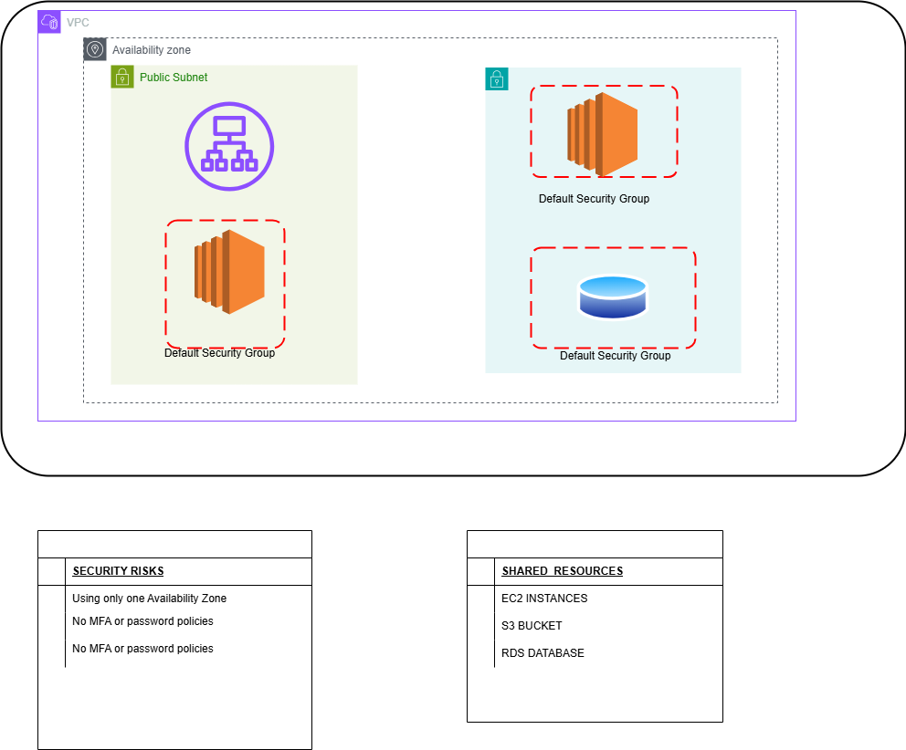

# iam_project

StartupCo, a fast-growing tech startup that recently launched their first product — a fitness tracking application. They’ve been using AWS for three months, initially setting up their infrastructure quickly to meet launch deadlines. Now that their product is live, they need to address their cloud security fundamentals. The company has 10 employees who all currently share the AWS root account credentials to access and manage their cloud resources. This practice started when they were moving quickly to launch, but now their CTO recognizes the security risks this poses.

